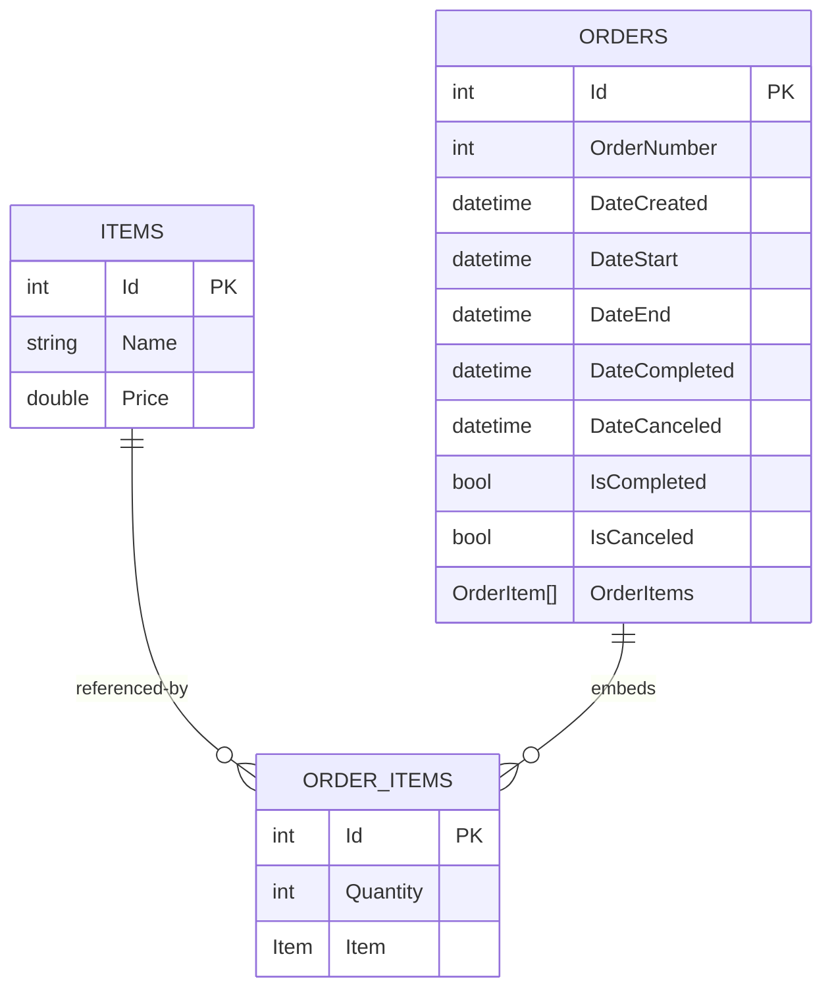

# Order Manager App

Order Manager App is a .NET 8 solution for managing items and orders with a .NET MAUI front end, a LiteDB-backed data layer, shared Razor UI components, localization support, and automated tests.

## Overview

The application is designed to help track order progress from creation through completion or cancellation. It includes:

- A dashboard with order counts and revenue summaries
- Item management with create, edit, and delete flows
- Order management with status filtering, sorting, pagination, and item assignment
- Theme and language preferences stored locally on the device
- English and Hungarian translations

The solution is split into reusable libraries so the UI, database logic, and localization resources stay separated from the MAUI host.

## Features

### Dashboard

- Shows total, completed, pending, and canceled order counts
- Displays total revenue, revenue for the current month, and pending revenue
- Supports quick navigation into filtered order views

### Items

- Create, edit, and delete catalog items
- Store item name and price in LiteDB
- Open the add-item dialog from the Items page or from the order editor when no items exist

### Orders

- Create and edit orders with order number, start/end date and time, and selected items
- Mark pending orders as completed
- Cancel orders through the edit dialog
- Filter by completed, pending, and canceled status
- Sort by order number, duration, created date, completed date, canceled date, start date, or end date
- Paginate order lists with a configurable page size
- Expand orders to inspect timestamps, duration, line items, and totals

### Settings

- Switch application language between English and Hungarian
- Switch between system default, light, and dark theme modes
- Configure how many orders appear per page

## Solution Structure

- OrderManagerApp: MAUI host application and shell UI
- DatabaseLibrary: LiteDB service, models, and shared utilities
- UILibrary: reusable Razor components, cards, and dialogs
- Languages: shared localization resources for English and Hungarian text
- DatabaseLibrary.Tests: unit tests for the database service and domain behavior

## Requirements

- .NET 8 SDK
- .NET MAUI workload for building the mobile and desktop app targets
- A supported IDE with .NET MAUI support for target-specific builds

## Getting Started

### Clone the repository

```bash
git clone <repository-url>
cd Order-Manager-App
```

### Restore dependencies

```bash
dotnet restore OrderManagerApp.sln
```

### Build the solution

```bash
dotnet build OrderManagerApp.sln
```

### Run the tests

```bash
dotnet test OrderManagerApp.sln
```

## Running the App

The UI project is a .NET MAUI application, so the most reliable way to launch it is from an IDE that supports MAUI target frameworks.

Typical targets include:

- Android
- iOS
- Mac Catalyst
- Windows, when building on Windows

The app uses a single shared MAUI project and renders the Razor-based interface inside a BlazorWebView host.

## Data Storage

The app stores data in LiteDB. By default, the database file is created in the current user's local application data folder with the name of the database assembly.

The database layer manages three collections:

- Items
- Orders
- OrderItems

## Data Model Diagram

The project does not use a relational SQL database, so there are no SQL foreign keys or join tables. The relationships are implemented in application code and stored as LiteDB documents. Orders embed their line items, and each order item contains an item object.



## Localization and Preferences

Localization is handled through shared resource files in the Languages project. The available cultures are:

- en-US
- hu-HU

User preferences are stored locally with MAUI Preferences, including:

- Language
- Theme
- Order page size

## Testing

The test project covers the database layer with MSTest and verifies core behaviors such as:

- Item create, update, delete, and retrieval
- Order create, update, delete, filtering, and totals
- Order item create, update, and delete

Run the full test suite with:

```bash
dotnet test OrderManagerApp.sln
```

## Notes

- Order numbers must be unique.
- Orders are considered pending until they are marked completed or canceled.
- When no items exist, the order editor provides a shortcut to create the first item.
- Completed orders contribute to revenue summaries, while canceled orders are excluded from totals.

## Project Files

- [OrderManagerApp/OrderManagerApp.csproj](OrderManagerApp/OrderManagerApp.csproj)
- [DatabaseLibrary/DatabaseLibrary.csproj](DatabaseLibrary/DatabaseLibrary.csproj)
- [UILibrary/UILibrary.csproj](UILibrary/UILibrary.csproj)
- [DatabaseLibrary.Tests/DatabaseLibrary.Tests.csproj](DatabaseLibrary.Tests/DatabaseLibrary.Tests.csproj)
- [Languages/Languages.csproj](Languages/Languages.csproj)
